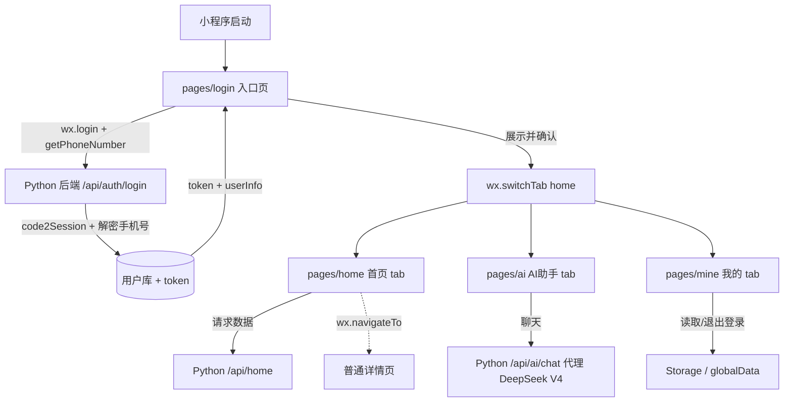

## 用户需求

规划微信小程序的完整前端架构，覆盖：进入后用户信息获取、用户信息展示与确认、首页展示、tab 标签切换、前端路由设计、后端数据请求，以及调用 AI（DeepSeek V4）能力的实现方式。

## 产品概述

- 用户进入小程序先经过登录页，使用"手机号一键登录"；由用户自建的 Python 后端完成微信 `code2Session` 与手机号解密，返回登录态 `token` 与用户资料，前端零密钥。
- 登录页展示获取到的用户信息，用户确认后通过 `wx.switchTab` 进入首页（tabBar 第一页）。
- 首页、AI 助手、我的 三个页面通过自定义 tabBar 切换；详情等普通页使用 `wx.navigateTo` 跳转。
- 页面通过统一请求层调用 Python 后端业务接口获取/提交数据。
- AI 能力（DeepSeek V4）由 Python 后端代理，前端只调用自有 `/api/ai/chat` 接口，模型密钥不暴露在前端。

## 核心功能

- 手机号一键登录与登录态管理（token 持久化、请求注入、401 过期跳登录）
- 用户信息展示 + 确认进入
- 自定义 tabBar 与多 tab 页切换（首页 / AI 助手 / 我的）
- 统一网络请求层（baseURL、token 注入、错误拦截、loading 兜底）
- 后端业务数据接口调用（首页数据等）
- AI 对话页调用 DeepSeek（非流式，后端代理，预留 WebSocket 流式）

## 技术栈

- 前端：微信小程序原生 + TypeScript（strict）+ SCSS + Skyline(glass-easel)，沿用自定义导航栏
- 后端：用户自建 Python 服务（负责 code2Session、手机号解密、业务数据、DeepSeek 代理）
- AI：DeepSeek V4，经 Python 后端代理调用，模型 key 仅存后端

## 实现方案

- **路由架构**：`app.json` 的 `pages` 数组把登录页放在首位作为启动入口（非 tabBar 普通页）；首页/AI/我的 注册为 tabBar 页，并配置 `"tabBar": { "custom": true, "list": [...] }` 启用自定义 tabBar。登录成功 `wx.switchTab` 到首页；tab 间切换用 `wx.switchTab`，列表/详情等用 `wx.navigateTo`。
- **登录流程**：`login` 页先 `wx.login()` 取 `code`，再通过 `button open-type="getPhoneNumber"` 取 `encryptedData/iv` → 调用后端 `/api/auth/login` → 后端 `code2Session` + 解密手机号 + 建号/登录 → 返回 `token` + `userInfo` → 前端写入 `wx.setStorageSync('token')` 与 `globalData.userInfo` → 页面展示资料并"确认" → `switchTab` 首页。
- **请求层**：`services/request.ts` 将 `wx.request` 封装为 Promise，统一注入 `Authorization` 头、处理 401（清登录态跳登录）、业务错误 `wx.showToast`、统一 loading，避免在各页散落网络代码。
- **AI 调用**：`services/ai.ts` 调 `/api/ai/chat`（非流式 JSON 请求/响应），后端转发 DeepSeek V4；前端 AI 页维护消息列表与输入态。后续可改用 `wx.connectSocket` 实现流式（小程序 `wx.request` 不支持流式）。
- **自定义 tabBar**：`custom-tab-bar/index` 组件复刻 `navigation-bar` 中使用 `wx.getMenuButtonBoundingClientRect`/`wx.getSystemInfo` 的安全区计算逻辑，处理底部安全区与选中态高亮，与自定义导航栏共存。

## 实现要点

- Skyline 下所有页面（含 tabBar 页）统一用 `Component` 构造，沿用现有 `pages/index/index.ts` 的写法。
- 自定义 tabBar 目录名固定为 `custom-tab-bar`，且 `app.json` 必须配置 `tabBar.custom=true` + `list`（list 用于配置页面路径与文案，图标可省略因自定义渲染）。
- `token` 持久化用 `wx.setStorageSync('token')`，运行时用户资料放 `globalData`，避免频繁读取。
- 微信 AppSecret 与 DeepSeek key 一律只在 Python 后端，前端不持有任何密钥。
- 错误与 loading 在请求层集中处理，避免日志刷屏；请求层统一兜底 401 跳转登录页。

## 架构设计

### 系统架构图



### 分层结构

- 表现层：页面 `Component` + 自定义 `navigation-bar` / `custom-tab-bar`
- 服务层：`services/request.ts` 统一网络 + `auth/home/ai` 业务接口封装
- 状态层：`app.globalData`（运行时）+ `wx.Storage`（持久化 token）
- 后端层：Python 服务（鉴权、业务、DeepSeek 代理）

## 目录结构

```
miniprogram/
├── app.json              # [MODIFY] pages 首位改为 login 入口；新增 tabBar(custom) 与 home/ai/mine 注册；保留 navigationStyle=custom
├── app.ts                # [MODIFY] globalData 增加 token/userInfo 字段与启动登录态读取；保留 logs 存储逻辑或迁移
├── app.scss              # [MODIFY] 补充主题变量、tabBar 安全区与全局卡片样式
├── custom-tab-bar/
│   ├── index.ts          # [NEW] 自定义 tabBar 组件：底部安全区适配、选中态、switchTab 跳转
│   ├── index.wxml        # [NEW] 三个 tab 的图标/文案布局
│   ├── index.scss        # [NEW] tabBar 样式（玻璃拟态/圆角悬浮）
│   └── index.json        # [NEW] 组件声明
├── pages/
│   ├── login/
│   │   ├── login.ts      # [NEW] 手机号一键登录 + 信息展示 + 确认进入（wx.login/getPhoneNumber + 调 auth 服务）
│   │   ├── login.wxml    # [NEW] 授权按钮、资料卡片、确认按钮
│   │   ├── login.scss
│   │   └── login.json
│   ├── home/
│   │   ├── home.ts       # [NEW] 首页（tab），通过 home 服务请求后端数据并渲染
│   │   ├── home.wxml
│   │   ├── home.scss
│   │   └── home.json
│   ├── ai/
│   │   ├── ai.ts         # [NEW] AI 对话页（tab），调 ai 服务，维护消息列表
│   │   ├── ai.wxml
│   │   ├── ai.scss
│   │   └── ai.json
│   ├── mine/
│   │   ├── mine.ts       # [NEW] 我的（tab），展示资料、退出登录
│   │   ├── mine.wxml
│   │   ├── mine.scss
│   │   └── mine.json
│   ├── index/            # [DELETE] 原模板页，由 login/home 体系替代
│   └── logs/             # [DELETE] 原模板页（或按需改造为普通页，本规划移除）
├── services/
│   ├── request.ts        # [NEW] wx.request Promise 封装：baseURL、token 注入、401 跳转、错误 toast、loading
│   ├── auth.ts           # [NEW] login(phone)、getUserInfo、logout 接口封装
│   ├── home.ts           # [NEW] 首页数据接口封装
│   └── ai.ts             # [NEW] 调用 /api/ai/chat 的接口封装
├── components/
│   └── navigation-bar/   # [REUSE] 现有自定义导航栏，安全区计算逻辑供 tabBar 复用
└── utils/
    └── util.ts           # [REUSE] 时间/格式化工具
```

## 关键代码结构

```ts
// services/request.ts（接口契约，非实现）
interface RequestOptions {
  url: string
  method?: 'GET' | 'POST' | 'PUT' | 'DELETE'
  data?: Record<string, any>
  showLoading?: boolean
  auth?: boolean // 是否注入 token，默认 true
}
declare function request<T = any>(options: RequestOptions): Promise<T>

// services/auth.ts
declare function phoneLogin(params: {
  code: string
  encryptedData: string
  iv: string
}): Promise<{ token: string; userInfo: UserInfo }>
declare function getUserInfo(): Promise<UserInfo>

// services/ai.ts
declare function chatWithAI(params: {
  messages: { role: 'user' | 'assistant'; content: string }[]
}): Promise<{ content: string }>
```

## 设计风格

采用现代渐变 + 玻璃拟态（Glassmorphism）的精致风格，圆角卡片、柔和阴影、靛紫渐变主色，营造高端科技感。所有页面复用顶部自定义导航栏，底部使用悬浮玻璃质感自定义 tabBar。

## 页面规划（4 屏）

### 1. 登录页（login）

- 顶部品牌区：渐变背景 + 应用 Logo 与欢迎语。
- 授权卡片：微信"手机号一键登录"按钮（绿色微信色），下方小字说明隐私用途。
- 用户信息卡片：登录成功后展示头像、昵称、手机号脱敏，玻璃卡片。
- 确认进入按钮：渐变主按钮，点击 `switchTab` 首页。

### 2. 首页（home，tab）

- 顶部导航栏 + 问候语与用户头像。
- 数据概览卡片网格：调用后端接口展示关键指标（渐变卡片）。
- 快捷入口区：图标按钮组。
- 推荐内容列表：卡片流，点击 `navigateTo` 详情。

### 3. AI 助手页（ai，tab）

- 顶部标题栏。
- 对话消息区：用户气泡（右，主色）与 AI 气泡（左，玻璃灰），自适应高度滚动。
- 底部输入栏：圆角输入框 + 发送按钮，加载态显示"思考中"。

### 4. 我的页（mine，tab）

- 个人信息头部卡片（头像、昵称、手机号）。
- 功能列表：资料编辑、关于、退出登录（红色）。
- 自定义 tabBar：底部四段式，选中态主色高亮 + 微缩放动效。

## 交互与动效

- 卡片入场淡入上移微动画；按钮点击缩放反馈；tab 切换内容淡入；AI 消息逐条滑入。所有动效轻量，避免影响 Skyline 性能。